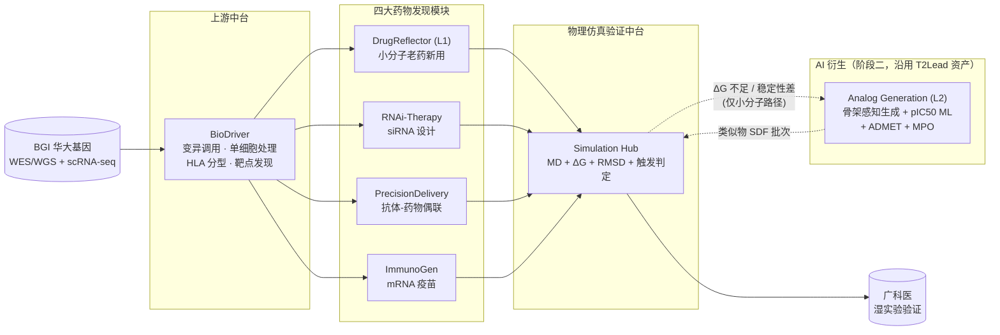
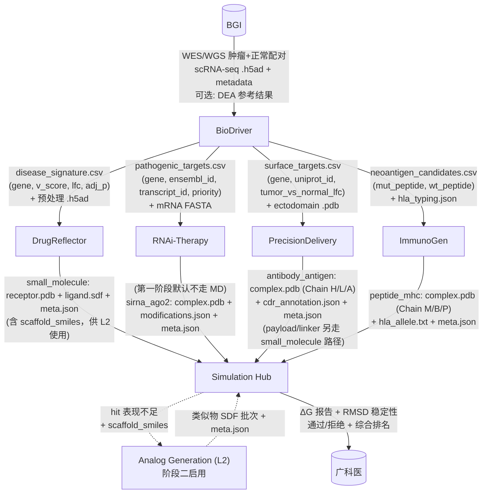

# 架构与数据流图

> 所有 Mermaid 图可以直接在 GitHub/VSCode/Typora 渲染。  
> 如果团队成员渲染有问题，PDF 版可以用 `mermaid-cli` 导出。

## 1) 架构图（System Architecture）



> 虚线代表"**闭环触发**"：只有小分子路径（DrugReflector）接收 Sim Hub 的反馈，触发 Level 2 类似物生成。其它三条路（RNAi/ADC/疫苗）的"不达标"反馈走各自内部再设计，不经过 Analog Generation。

## 2) 数据流图（Data Flow，带字段级接口）



## 3) Simulation Hub 输入契约（**上游 → SimHub**）

> **🔒 字段级唯一真相源 → [`SIMHUB_CONTRACT.md`](./SIMHUB_CONTRACT.md)**。本节是架构视角的摘要，任何契约改动**只在 SIMHUB_CONTRACT.md 里做**，不要在这里同步维护。
>
> **这是 4 个下游药物发现模块提交给 Simulation Hub 的输入**；不是 SimHub 给医院的输出。后者见第 6 节。

**不同 `molecule_type` 走不同契约，强行混用会让力场 pipeline 直接炸**（多肽/抗体不能用 `.sdf` + AM1-BCC，必须走 AMBER14SB 蛋白力场）。

### 3.1 `small_molecule`（DrugReflector / AnalogGen）

```
deliveries/<run_id>/to_simhub/<case_id>/
├── receptor.pdb      # 靶蛋白单体/结构域；清理后（无结晶水、原配体、杂离子）
├── ligand.sdf        # 3D 小分子；已对接到口袋；pH 7.4 加氢；仅 C/H/O/N/S/P/F/Cl/Br/I
└── meta.json
```

- **力场**：AMBER14SB（受体）+ OpenFF/GAFF + AM1-BCC（配体）

### 3.2 `peptide_mhc`（ImmunoGen）

```
deliveries/<run_id>/to_simhub/<case_id>/
├── complex.pdb       # 纯蛋白多链：Chain M (MHC α) + Chain B (β2m) + Chain P (peptide)
│                     # 全部标准氨基酸残基；禁止 UNK / HETATM 非标残基
├── hla_allele.txt    # 可选：HLA 等位基因字符串（如 "HLA-A*02:01"）
└── meta.json
```

- **力场**：AMBER14SB 纯蛋白-蛋白；**绝不**走 GAFF / AM1-BCC
- **校验**：链 ID 必须齐全；肽链 9-11 残基；两条 α 链残基编号与标准 MHC 编号一致

### 3.3 `antibody_antigen`（PrecisionDelivery：ADC / SMDC / BiTE）

```
deliveries/<run_id>/to_simhub/<case_id>/
├── complex.pdb       # 纯蛋白多链：Chain H (VH) + Chain L (VL) + Chain A (Antigen 胞外域)
│                     # BiTE 情况：额外 Chain H2 + Chain L2 + Chain T (CD3ε 胞外域)
│                     # 全部标准氨基酸；CDR loop 不可缺失
├── cdr_annotation.json    # 可选：CDR H1/H2/H3 + L1/L2/L3 的残基编号（Kabat 或 IMGT）
└── meta.json
```

- **力场**：AMBER14SB 纯蛋白-蛋白；ADC 的 linker/payload **另路径评估**（走 3.1 small_molecule 单独做，不在抗体-抗原 MD 里一起建模）
- **校验**：SSBOND 必须写全（抗体有多对二硫键，漏掉直接结构散架）；至少 3 条链

### 3.4 `sirna_ago2`（RNAi-Therapy）第一阶段**可选**

```
deliveries/<run_id>/to_simhub/<case_id>/
├── complex.pdb       # Chain S (sense RNA) + Chain A (antisense RNA) + Chain P (Ago2 protein)
│                     # 核酸残基名：A/U/G/C（RNA），禁止 DNA（DA/DT/DG/DC）
│                     # 化学修饰用 HETATM + CONECT 表示，并在 meta 说明
├── modifications.json      # 每个修饰位置的化学结构描述（2'-OMe / PS / LNA 等）
└── meta.json
```

- **力场**：AMBER OL3（RNA）+ AMBER14SB（Ago2）
- **第一阶段默认不跑 MD**：RNAi 模块第一阶段只交脱靶评分 + 二级结构给 Lead，SimHub 不走 MD（第二阶段再接入）

---

### 3.5 所有 molecule_type 共享的 `meta.json`

```json
{
  "case_id": "string",
  "upstream_module": "DrugReflector|RNAi-Therapy|PrecisionDelivery|ImmunoGen|AnalogGen",
  "molecule_type": "small_molecule|peptide_mhc|antibody_antigen|sirna_ago2",
  "target_name": "string (e.g., KRAS_G12C, HLA-A*02:01)",
  "target_uniprot": "string | null",
  "upstream_score": "float (模块内部打分)",
  "priority": "high|medium|low",
  "notes": "free text",

  "parent_hit_id": "string | null",
  "scaffold_smiles": "string | null (仅 small_molecule 用)",
  "generation_source": "repositioning | analog_generation | de_novo"
}
```

> `parent_hit_id / scaffold_smiles / generation_source` 三个字段支撑小分子路径的 L1 ↔ L2 闭环；蛋白路径忽略即可。

### 3.6 拒收原因码（SimHub 统一返回）

| 代码 | 含义 |
|------|------|
| `E_MISSING_FILE` | 契约要求的文件缺失 |
| `E_WRONG_FORMAT` | 小分子传了 PDB 或多肽传了 SDF |
| `E_NONSTANDARD_RESIDUE` | complex.pdb 里出现 UNK/非标残基但不在 modifications 里声明 |
| `E_CHAIN_ID_MISSING` | 必需的 chain ID 不全（如 peptide_mhc 缺 Chain P） |
| `E_UNSUPPORTED_ELEMENT` | 小分子含 GAFF 不支持的元素（如重金属） |
| `E_LIGAND_NOT_DOCKED` | ligand.sdf 远离 receptor.pdb 口袋（初始距离 > 10Å） |
| `E_SSBOND_MISSING` | 抗体 PDB 没写 SSBOND |
| `E_META_INCOMPLETE` | meta.json 必填字段缺失 |

上游收到拒收 → 修材料 → 重新提交（完整闭环走 `rejections/<case_id>/reason.md`）。

## 4) 分子类型与 Simulation Hub 的优先级

| 分子类型 | 上游模块 | Simulation Hub 支持 | 优先级 |
|---------|---------|---------------------|-------|
| 小分子-蛋白复合物 | DrugReflector | 已有（T2Lead Stage4） | P0（立即） |
| peptide-MHC 复合物 | ImmunoGen | 蛋白-蛋白力场可支持（AMBER14SB） | P1 |
| 抗体-抗原复合物 | PrecisionDelivery | 蛋白-蛋白 MD 可支持 | P1 |
| siRNA-Ago2/RNA 复合物 | RNAi-Therapy | 需核酸力场（AMBER OL3/DESRES） | P2（后期） |

> RNAi-Therapy 在第一阶段可以**不走标准 MD**，改用"脱靶 + 二级结构评估"交付给 Lead，避免核酸力场的复杂性。

## 4.1) 小分子路径的两级能力与闭环（L1 → L2）

小分子路径有两级能力，**不是并列，而是逐级启用**：

| Level | 名字 | 能力 | 阶段 | 责任人 |
|-------|------|------|------|-------|
| **L1** | Repositioning | DrugReflector 表型匹配，输出现成小分子 hits | 第一阶段必达 | DrugReflector 负责人（姜可盈） |
| **L2** | Analog Generation | 基于 L1 弱 hit 的骨架生成类似物，复用 T2Lead 生成+打分链路 | 第二阶段拓展 | Lead 维护引擎，DrugReflector 负责人触发与解读 |

**触发规则（Sim Hub 内置判定器，阶段二开启）：**

```
if molecule_type == "small_molecule"
   and generation_source == "repositioning"
   and (ΔG > threshold_dg  OR  RMSD_mean > threshold_rmsd):
     trigger AnalogGeneration(scaffold_smiles, parent_hit_id)
```

**Analog Generation 内部（沿用 T2Lead 代码）：**

```
scaffold_smiles ──► 骨架感知生成 (src/drugpipe/target_to_hit)
                 ──► pIC50 回归 (RF+MLP, ChEMBL)
                 ──► ADMET / QED 过滤
                 ──► MPO 打分 (src/drugpipe/hit_to_lead/mpo.py)
                 ──► 输出类似物 SDF 批次
                 ──► 回送 Simulation Hub，携带 generation_source=analog_generation
```

**防循环保护**：类似物回送 Sim Hub 后**不再触发下一轮 L2**（避免无限衍生）。最多进一次 L2 闭环。

---

## 5) 数据一致性与版本控制

- 所有模块输出必须带 **`version` + `run_id` + `timestamp`** 字段。
- 每次交付到 Simulation Hub 都生成一个 `delivery_<date>_<module>_<case_id>/` 目录。
- Simulation Hub 的综合报告同样归档到 `deliveries/<timestamp>/`。

---

## 6) Simulation Hub → 广科医 的最终交付（"决策级候选档案"）

> **这是 SimHub 的输出**（最终给医院湿实验组的材料），**不要与第 3 节"上游 → SimHub"的输入契约混淆**。
>
> - 第 3 节：4 下游 → SimHub，格式按 `molecule_type` 分（receptor+ligand 或 complex.pdb）
> - 第 6 节：SimHub → 医院，按**疗法线**分装 dossier

**不是单一格式**，按疗法线不同而不同。每个候选打包成独立 dossier：

```
to_hospital/<run_id>/<candidate_id>/
├── SUMMARY.md              # 一页纸：疗法类型 / 靶点 / 推荐理由 / 风险
├── target_info.json        # 靶点基础信息（gene, uniprot, tumor_vs_normal）
├── molecule/               # 分子材料（格式看疗法）
│   ├── <small_molecule>.sdf         # DrugReflector
│   ├── <ab_vh>.fasta + <ab_vl>.fasta + complex.pdb + linker.sdf + payload.sdf  # ADC
│   ├── <sirna>.csv         # RNAi（序列 + 修饰）
│   └── <mrna>.fasta + peptide_mhc.pdb   # mRNA 疫苗
├── simhub_evidence/        # 来自 Simulation Hub 的验证证据
│   ├── energy_report.json  # ΔG / MM-GBSA 分解
│   ├── rmsd_profile.csv
│   └── trajectory_snapshot.pdb
└── risks.md                # 已知风险与限制
```

另外有一份**全局综合报告**（跨所有候选）：

```
to_hospital/<run_id>/FINAL_RANKING.csv    # 按 dG / 稳定性 / 优先级排序
to_hospital/<run_id>/DASHBOARD.html       # 可视化 dashboard（ΔG bar、结构预览、备选理由）
```

> 核心思想：给广科医的不是"一堆数据"，而是"**每个候选一个决策包**"，里面有决策所需的材料 + 证据 + 风险。湿实验组拿到能直接决定"测哪个 / 不测哪个"。

**疗法形态 → 广科医需要的最小材料**

| 疗法线 | 分子材料（必给） | 结构材料（必给） | 验证证据（Simulation Hub） |
|--------|-----------------|-----------------|--------------------------|
| DrugReflector（小分子） | SMILES + 3D SDF | 靶点 PDB | ΔG + RMSD |
| RNAi-Therapy | sense/antisense 序列 + 修饰 | 无（可选 RNA 二级结构图） | 脱靶评分 + 可及性（第一阶段不走 MD） |
| PrecisionDelivery (ADC) | VH/VL FASTA + linker SDF + payload SDF | 抗体-抗原复合物 PDB | 蛋白-蛋白 MD 稳定性 |
| ImmunoGen（mRNA 疫苗） | 完整 mRNA FASTA（含 UTR） | peptide-MHC PDB | pMHC MD 稳定性 + 免疫原性评分 |
